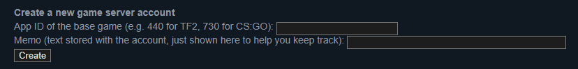
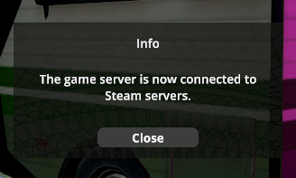

# Scheduled
A mod for Schedule I which adds:
- Performance improvements (configurable)
- Discord inviting support (configurable) & minimal RPC
- Stack limit multiplier (configurable)
- Dedicated server mode/Steam Game Server support

# Steam Game Server
## How to set up a dedicated server
1. Paste the following link in your browser to open the Steam Game Server management page automatically logged in, in the Steam app.
	- steam://openurl/https://steamcommunity.com/dev/managegameservers
2. Scroll down to the bottom, until you see the following:

3. Enter the following:
	- **App ID**: `3164500`
    - **Memo**: `S1 Server` *(optional)*
4. Click on the **Create** button.
5. Double-click on the **Token** text, in the new entry that was made, to select it. Then, press <kbd><kbd>Ctrl</kbd>+<kbd>C</kbd></kbd> to copy it.
6. Open the game's directory, and open the `BepInEx/config/io.github.stupidrepo.Scheduled.cfg` file.
7. Set `DedicatedServerMode` to `true`, and paste the token in the `ServerLoginToken` field.
8. Save the file, then start the game. If it works, you should see the following popup:
